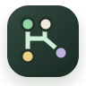
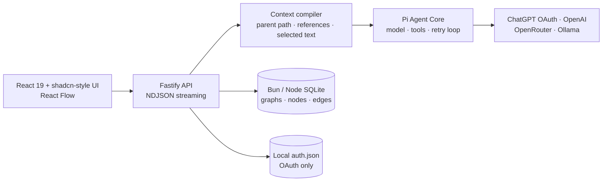

<div align="center">
  <a href="https://xnu.app/graphchat/">
    
  </a>

  <h1>Graph Chat</h1>

  <p><strong>Learn in branches. Remember in graphs.</strong></p>
  <p>Turn AI conversations into a knowledge graph that can branch, reference, converge, and keep growing.</p>

  <p><strong>English</strong> · <a href="./README.zh-CN.md">简体中文</a></p>

  <p>
    <a href="https://xnu.app/graphchat/"><strong>Website</strong></a>
    ·
    <a href="#quick-start">Quick start</a>
    ·
    <a href="#use-your-chatgpt-subscription">ChatGPT login</a>
    ·
    <a href="#architecture">Architecture</a>
  </p>

  <p>
    
    
    
    
    
    
    
  </p>
</div>

<br />

Graph Chat is a local-first, graph-native AI learning workspace. When an answer introduces an unfamiliar concept, you no longer have to bury every follow-up inside one increasingly tangled chat. Branch from any node, explore the idea in its own context, then reference multiple branches to form a new question. Every answer preserves the context and sources it actually used.

## Why a graph instead of a chat list?

A regular chat remembers only what you asked next. Graph Chat also remembers where a question came from, which explanations it referenced, and how the resulting understanding reconnects to the main thread.

```text
Starting question ──→ AI answer ──→ New concept A ──→ Deeper explanation
                            │
                            └────→ New concept B ──→ Examples and counterexamples
                                                         ╲
                              Explanation of A ·········→ Synthesis ──→ New understanding
```

- Solid edges continue the current context.
- Dotted edges reference another branch for comparison, synthesis, or knowledge transfer.
- Nodes retain the question, answer, model, context snapshot, and source relationships.
- The graph is the durable knowledge structure; the Pi agent loop powers each answer.

## Features

| Capability | Current implementation |
| --- | --- |
| Graph-native learning | Infinite React Flow canvas, branch edges, cross-branch references, dragging, and search |
| Multiple knowledge graphs | Create, switch, rename, archive, and restore independent learning spaces |
| Precise follow-ups | Continue from any node or branch from selected text inside an answer |
| Branch synthesis | Reference multiple nodes so the model can compare, combine, or find a shared mechanism |
| Agent runtime | Pi agent core, streaming events, tool calls, automatic retry, and cancellation |
| ChatGPT subscription | Pi `openai-codex` device-code OAuth with automatic token refresh |
| Other models | OpenAI API, OpenRouter, Ollama, and OpenAI-compatible endpoints |
| Local data | Bun/Node SQLite, WAL, JSON export, and no external database |
| English and Chinese | English-first application and documentation with a persistent Chinese switch |
| Resilient runs | Run-scoped streaming, explicit cancellation, and interrupted-run recovery |
| Privacy boundary | API keys stay in process; OAuth credentials stay in a private local file |
| Engineering quality | Strict TypeScript, Vitest, database and Pi runtime tests, and Playwright E2E |

## Quick start

### Standalone release

The easiest path needs no Bun, Node.js, or database installation:

1. Download the archive for your platform from [the latest GitHub release](https://github.com/everettjf/graphchat/releases/latest).
2. Extract it.
3. Run `graphchat` (`graphchat.exe` on Windows).

Graph Chat opens `http://127.0.0.1:4317` in your browser and stores its data in `.graphchat/`.

### Run from source

Bun 1.3+ is recommended. Node.js 22.19+ is also fully supported.

```bash
git clone https://github.com/everettjf/graphchat.git
cd graphchat
bun install
bun run graphchat
```

The `graphchat` launcher builds the application, starts the local service, and opens it in your browser. For hot-reload development, use `bun run dev` and open [http://localhost:5173](http://localhost:5173).

On first launch, Graph Chat creates an English example graph about RAG. The interface defaults to English and can be switched to Chinese from the top bar. The local demo follows the selected language, needs no credentials, and never contacts an external model.

Production mode:

```bash
bun run build
bun run start:bun
```

The production server listens on `http://127.0.0.1:4317` by default.

Prefer Node/npm? Use `npm install`, `npm run dev`, `npm run build`, and `npm start`. Bun and Pi do not conflict: Pi owns the agent harness, model integrations, OAuth flow, and tool loop, while Bun/Node runs the local HTTP server, SQLite, and frontend toolchain. Graph Chat uses `bun:sqlite` under Bun and `node:sqlite` under Node.

## Use your ChatGPT subscription

Graph Chat uses Pi's built-in `openai-codex` provider, so you can sign in with an eligible ChatGPT subscription instead of copying an API key.

1. Open **Models & settings** in the lower-left corner.
2. Choose **ChatGPT**.
3. Select **Sign in with ChatGPT**.
4. Enter the one-time device code on the OpenAI page.
5. Return to Graph Chat. The connection status updates automatically; choose a model and save.

Pi initiates the login flow, and Graph Chat never receives your password. OAuth access and refresh credentials are stored in `.graphchat/auth.json`; they never appear in the browser API, logs, or graph exports. Signing out deletes the saved credential. Available Codex models and usage limits depend on your account, plan, and OpenAI's current policies.

> OpenAI documents ChatGPT-plan access to Codex and notes that usage limits vary by plan. See [Using Codex with your ChatGPT plan](https://help.openai.com/en/articles/11369540).

## Other providers

Copy `.env.example` to `.env`, or configure a provider directly in settings:

| Provider | Authentication | Default configuration |
| --- | --- | --- |
| OpenAI | `OPENAI_API_KEY` or an in-process key | Pi OpenAI provider |
| OpenRouter | `OPENROUTER_API_KEY` or an in-process key | Pi OpenRouter provider |
| Ollama | No key required | `http://127.0.0.1:11434/v1` |
| Custom | Optional in-process API key | Any OpenAI-compatible endpoint |

## Architecture



Graph Chat does not send the entire graph to a model. The context compiler builds a bounded, traceable snapshot from the active parent node, explicit references, and selected text. Pi can use read-only graph tools to search or inspect more nodes, but it cannot modify the knowledge graph by itself.

Core code:

- [`server/agent-runtime.ts`](./server/agent-runtime.ts) — Pi agent, model routing, tools, and streaming events
- [`server/openai-codex-auth.ts`](./server/openai-codex-auth.ts) — ChatGPT device-code OAuth lifecycle
- [`server/context-compiler.ts`](./server/context-compiler.ts) — graph context selection and budget
- [`server/credential-store.ts`](./server/credential-store.ts) — atomic, minimally exposed local OAuth storage
- [`src/components/graph-canvas.tsx`](./src/components/graph-canvas.tsx) — graph interactions

## Data and security

- Default data directory: `.graphchat/`
- Knowledge graph database: `.graphchat/graphchat.sqlite`
- ChatGPT OAuth credentials: `.graphchat/auth.json`
- API keys: current process only; never written to SQLite or `auth.json`
- Exports: graphs, nodes, and edges only; no credentials
- Default bind address: `127.0.0.1`, not automatically exposed to the local network

Set `GRAPHCHAT_DATA_DIR` to change the data location. On platforms that support POSIX permissions, the OAuth file uses mode `0600`. Protect this directory as you would any other local login credential.

## Development and verification

For end-to-end acceptance of importing, branching, synthesis, knowledge
metadata, review, metrics, and export, see
[`docs/CORE_TESTING.md`](./docs/CORE_TESTING.md).

The versioned JSON backup and knowledge-asset fields are documented in
[`docs/GRAPHCHAT_FORMAT.md`](./docs/GRAPHCHAT_FORMAT.md).

```bash
bun run typecheck  # TypeScript client and server
bun run test       # unit, database, credential, and Pi runtime tests
bun run build      # production build
bun run test:e2e   # Playwright end-to-end tests
bun run test:all   # complete verification
```

## Roadmap

- Graph snapshots and Markdown import
- Pluggable retrieval, web, and file tools
- Optional end-to-end encrypted sync
- Collaborative sharing and read-only graph publishing

## Contributing

Issues, discussions, and pull requests are welcome. Read [CONTRIBUTING.md](./CONTRIBUTING.md) first, then run `bun run test:all` (or `npm run test:all`) before submitting. New behavior should include corresponding tests. Report security issues privately as described in [SECURITY.md](./SECURITY.md).

## License

[MIT](./LICENSE) © Everett
