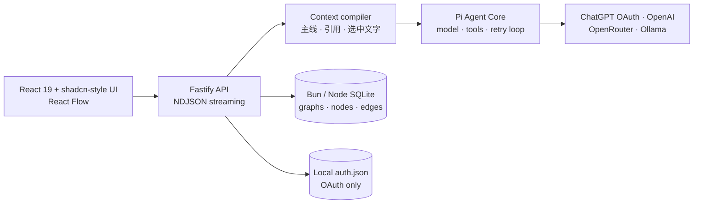

<div align="center">
  <a href="https://everettjf.github.io/graphchat/">
    
  </a>

  <h1>Graph Chat</h1>

  <p><strong>Learn in branches. Remember in graphs.</strong></p>
  <p>把 AI 对话变成一张可以分叉、引用、汇聚和继续生长的知识图。</p>

  <p>
    <a href="https://everettjf.github.io/graphchat/"><strong>产品主页</strong></a>
    ·
    <a href="#快速开始">快速开始</a>
    ·
    <a href="#使用-chatgpt-订阅">ChatGPT 订阅登录</a>
    ·
    <a href="#架构">架构</a>
  </p>

  <p>
    
    
    
    
    
    
    
  </p>
</div>

<br />

Graph Chat 是一个本地优先、图谱原生的 AI 学习工作区。面对回答里的陌生概念，你不需要把所有追问塞进一条越来越混乱的聊天记录：从任意节点创建分支，在分支中深入理解，再引用多个分支汇聚成新的问题。每次回答都会保留它实际使用的上下文与来源。

## 为什么是图，而不是聊天列表

普通聊天只记录“接下来问了什么”，Graph Chat 还记录“这个问题从哪里来、引用了哪些理解、最后回到了哪条主线”。

```text
原始问题 ──→ AI 回答 ──→ 陌生概念 A ──→ 深入解释
                  │
                  └────→ 陌生概念 B ──→ 例子与反例
                                      ╲
                    A 的解释 ·········→ 汇聚问题 ──→ 新理解
```

- 实线表示沿当前上下文继续追问。
- 虚线表示跨分支引用，适合比较、综合和迁移知识。
- 节点记录问题、回答、模型、上下文快照与来源。
- 图谱是长期知识结构，Pi agent loop 是每次回答的运行时。

## 功能

| 能力 | 当前实现 |
| --- | --- |
| 图谱学习 | React Flow 无限画布、分支边、跨分支引用边、拖拽与搜索 |
| 精确追问 | 从节点继续提问，也可以选中回答中的一段文字创建分支 |
| 分支汇聚 | 同时引用多个节点，让模型比较、综合或寻找共同机制 |
| Agent runtime | Pi agent core、流式事件、工具调用、自动重试与取消 |
| ChatGPT 订阅 | Pi `openai-codex` 设备码 OAuth，支持自动 token refresh |
| 其他模型 | OpenAI API、OpenRouter、Ollama、OpenAI-compatible endpoint |
| 本地数据 | Node.js SQLite、WAL、JSON 导出、无需外部数据库 |
| 隐私边界 | API Key 仅在进程内；OAuth 凭据只保存在本机私有文件 |
| 工程质量 | TypeScript strict、Vitest、数据库测试、Pi runtime 测试、Playwright E2E |

## 快速开始

推荐 Bun 1.3+；Node.js 22.19+ 也完整支持。

```bash
git clone https://github.com/everettjf/graphchat.git
cd graphchat
bun install
bun run dev
```

打开 [http://localhost:5173](http://localhost:5173)。首次运行会生成一张关于 RAG 的示例学习图；默认的“本地演示”无需密钥，也不会访问外部模型。

生产模式：

```bash
bun run build
bun run start:bun
```

生产服务默认监听 `http://127.0.0.1:4317`。

如果更习惯 Node/npm，可改用 `npm install`、`npm run dev`、`npm run build` 和 `npm start`。Bun 与 Pi 没有架构冲突：Pi 负责 agent harness、模型与 OAuth loop；Bun/Node 负责本地 HTTP、SQLite 和前端工具链。Graph Chat 会在 Bun 下使用 `bun:sqlite`，在 Node 下使用 `node:sqlite`。

## 使用 ChatGPT 订阅

Graph Chat 通过 Pi 内置的 `openai-codex` Provider 使用 ChatGPT 订阅，不需要复制 API Key。

1. 打开左下角的「模型与设置」。
2. 选择「ChatGPT」。
3. 点击「使用 ChatGPT 登录」。
4. 在 OpenAI 页面输入一次性设备码。
5. 返回 Graph Chat，连接状态会自动更新；选择模型并保存。

登录流程由 Pi 发起。Graph Chat 不接触你的密码；OAuth access/refresh credential 保存到 `.graphchat/auth.json`，不会出现在网页 API、日志或数据导出中。登出会删除该凭据。ChatGPT/Codex 的可用额度和模型取决于你的账户、方案与 OpenAI 当前政策。

> OpenAI 官方说明：Codex 可使用符合条件的 ChatGPT 方案登录，使用限制因方案而异。详见 [Using Codex with your ChatGPT plan](https://help.openai.com/en/articles/11369540)。

## 其他 Provider

复制 `.env.example` 为 `.env`，或直接在设置中配置：

| Provider | 认证方式 | 默认配置 |
| --- | --- | --- |
| OpenAI | `OPENAI_API_KEY` 或当前进程内输入 | Pi OpenAI Provider |
| OpenRouter | `OPENROUTER_API_KEY` 或当前进程内输入 | Pi OpenRouter Provider |
| Ollama | 无需密钥 | `http://127.0.0.1:11434/v1` |
| 自定义 | 可选进程内 API Key | 任意 OpenAI-compatible endpoint |

## 架构



Graph Chat 不把整张图无差别发送给模型。上下文编译器会按当前父节点、显式引用和选中文字构建一个有上限、可追溯的快照，再交给 Pi 运行。Pi 可以使用只读图谱工具继续搜索或读取节点，但不能自行修改知识图。

核心代码：

- [`server/agent-runtime.ts`](./server/agent-runtime.ts) — Pi agent、模型路由、工具和流式事件
- [`server/openai-codex-auth.ts`](./server/openai-codex-auth.ts) — ChatGPT 设备码 OAuth 生命周期
- [`server/context-compiler.ts`](./server/context-compiler.ts) — 图谱上下文选择与预算
- [`server/credential-store.ts`](./server/credential-store.ts) — 原子、最小暴露的本地 OAuth 存储
- [`src/components/graph-canvas.tsx`](./src/components/graph-canvas.tsx) — 图谱交互

## 数据与安全

- 默认数据目录：`.graphchat/`
- 知识图数据库：`.graphchat/graphchat.sqlite`
- ChatGPT OAuth：`.graphchat/auth.json`
- API Key：仅存当前 Node.js 进程，不写入 SQLite 或 `auth.json`
- 导出：只包含图谱、节点和边，不包含任何凭据
- 默认监听：`127.0.0.1`，不会自动暴露到局域网

如需更改数据位置，设置 `GRAPHCHAT_DATA_DIR`。OAuth 文件在支持 POSIX 权限的平台上使用 `0600`；请像保护其他本地登录凭据一样保护数据目录。

## 开发与验证

```bash
bun run typecheck  # TypeScript client + server
bun run test       # 单元、数据库、凭据与 Pi runtime
bun run build      # 生产构建
bun run test:e2e   # Playwright 端到端
bun run test:all   # 完整验证
```

## 路线图

- 多知识图创建、重命名和归档
- 图谱快照与 Markdown 导入
- 可插拔的检索、网页和文件工具
- 端到端加密的可选同步服务
- 协作分享与只读知识图发布

## 参与贡献

Issue、讨论和 Pull Request 都很欢迎。请先阅读 [CONTRIBUTING.md](./CONTRIBUTING.md)；提交前运行 `bun run test:all`（或 `npm run test:all`），并确保新增行为包含相应测试。安全问题请按 [SECURITY.md](./SECURITY.md) 私下报告。

## License

[MIT](./LICENSE) © Everett
