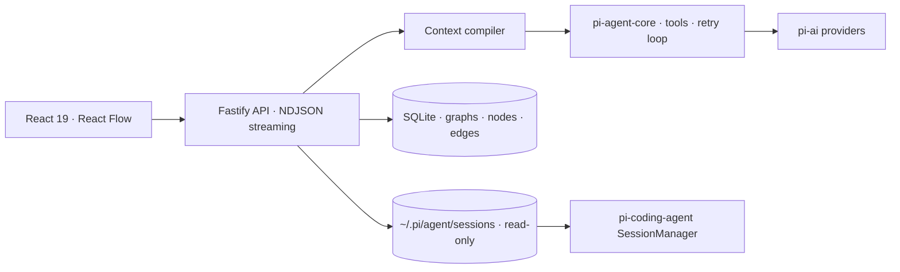

<div align="center">
  

  <h1>Pi Graph Chat</h1>

  <p><strong>Learn in branches. Remember in graphs. Built on Pi.</strong></p>
  <p>A personal, local-first learning workspace that turns AI conversations into a knowledge graph and shows your Pi coding-agent sessions as trees.</p>

  <p><strong>English</strong> · <a href="./README.zh-CN.md">简体中文</a></p>

  <p>
    
    
    
    
    
  </p>
</div>

<br />

Pi Graph Chat is a tool I build for my own learning. It is not a product and does
not try to be one. Two ideas hold it together:

1. **A conversation should be a graph, not a list.** Branch from any node, explore
   an idea in its own context, then reference several branches to ask a new
   question. Every answer keeps the context it actually used.
2. **Pi is the runtime.** The [Pi agent ecosystem](https://github.com/earendil-works/pi)
   already has a tree-shaped session format, thirty-plus providers, extensions,
   skills, and a coding agent. Pi Graph Chat leans on that instead of rebuilding it.

<div align="center">
  
  
</div>

## What it does today

| Area | Current implementation |
| --- | --- |
| Knowledge graphs | Infinite React Flow canvas, branch and continuation edges, cross-branch references, synthesis nodes, search |
| Precise follow-ups | Continue from any node, or select text inside an answer and branch from that phrase |
| Context compiler | Bounded, traceable context built from the parent path, explicit references, and selected text |
| Pi sessions | Read-only tree view of every Pi coding-agent session on this machine, auto-refreshing while Pi runs |
| Models via Pi | ChatGPT subscription (Codex OAuth), OpenAI, Anthropic, Google Gemini, OpenRouter, Ollama, any OpenAI-compatible endpoint |
| Local data | Bun/Node SQLite with FTS5, versioned JSON backup, Obsidian-friendly Markdown export |
| Import | Markdown, plain text, and text-based PDF |
| Study | Knowledge metadata, study cards, local graph metrics |
| Interface | English and Simplified Chinese, light and dark themes |

### Pi sessions

Run `pi` in any project. Pi stores the conversation as an append-only tree in
`~/.pi/agent/sessions/`. Pi Graph Chat reads those files and shows each session
as a tree of turns: one card per prompt plus the assistant work that followed,
with abandoned branches, tool calls, thinking, labels, and the current position.

- Click a session in the sidebar to open it. The view refreshes every few seconds,
  so a running `pi` session grows on the canvas as you work.
- **Open in terminal** copies `cd <cwd> && pi --session <file>` so you can
  continue the same session with Pi's full coding tools.
- The view is read-only. Pi owns the session file.

Set `PI_CODING_AGENT_SESSION_DIR` (or `PI_CODING_AGENT_DIR`) if your sessions
live somewhere else; Pi Graph Chat follows the same precedence as Pi.

## Quick start

Bun 1.3+ is required for development. Node.js 22.19+ can run the built server.

```bash
git clone https://github.com/everettjf/pi-graph-chat.git
cd pi-graph-chat
bun install
bun run launch
```

`bun run launch` builds the application, starts the local service on
`http://127.0.0.1:4317`, and opens it in your browser. For hot reload use
`bun run dev` and open [http://localhost:5173](http://localhost:5173).

On first launch, Pi Graph Chat creates an example graph about RAG that runs
without any credentials. Data lives in `.graphchat/`; set `GRAPHCHAT_DATA_DIR`
to move it.

## Models

Open **Models & settings** in the sidebar. Every provider is served by Pi's
`pi-ai` layer.

| Provider | Authentication |
| --- | --- |
| ChatGPT | Device-code OAuth through Pi's `openai-codex` provider; reuses an existing Codex CLI login when present |
| OpenAI | `OPENAI_API_KEY` or an in-process key |
| Anthropic | `ANTHROPIC_API_KEY` or an in-process key |
| Google Gemini | `GEMINI_API_KEY` or an in-process key |
| OpenRouter | `OPENROUTER_API_KEY` or an in-process key |
| Ollama | No key; `http://127.0.0.1:11434/v1` |
| Custom | Any OpenAI-compatible endpoint, optional in-process key |

API keys stay in the server process and are never written to SQLite, exports,
or logs. ChatGPT OAuth credentials are stored in `.graphchat/auth.json` with
mode `0600` where the platform supports it.

## Architecture


```mermaid
flowchart LR
    UI["React 19 · React Flow"] --> API["Fastify API · NDJSON streaming"]
    API --> CTX["Context compiler"]
    CTX --> AGENT["pi-agent-core · tools · retry loop"]
    AGENT --> MODELS["pi-ai providers"]
    API --> DB[("SQLite · graphs · nodes · edges")]
    API --> PI[("~/.pi/agent/sessions · read-only")]
    PI --> SM["pi-coding-agent SessionManager"]
```

Core code:

- [`server/agent-runtime.ts`](./server/agent-runtime.ts) — Pi agent, provider routing, graph tools, streaming events
- [`server/context-compiler.ts`](./server/context-compiler.ts) — graph context selection and budget
- [`server/pi-sessions.ts`](./server/pi-sessions.ts) — Pi session index and turn collapsing
- [`server/openai-codex-auth.ts`](./server/openai-codex-auth.ts) — ChatGPT device-code OAuth lifecycle
- [`src/components/graph-canvas.tsx`](./src/components/graph-canvas.tsx) — knowledge graph interactions
- [`src/components/pi-session-view.tsx`](./src/components/pi-session-view.tsx) — Pi session tree view

## Development

```bash
bun run typecheck  # TypeScript client and server
bun run test       # Vitest: database, credentials, Pi runtime, Pi sessions, UI
bun run build      # production build
bun run test:e2e   # Playwright
bun run test:all   # everything above
```

Run Vitest through the package scripts. They force Bun's runtime because the
database relies on SQLite FTS5; a Node SQLite build without FTS5 produces
misleading failures.

## Roadmap

The plan is to make Pi's session file the single source of truth and let Pi
Graph Chat add the graph layer on top. In order:

1. Read-only Pi session bridge — done.
2. Run answers through `createAgentSession()` from `pi-coding-agent` so graph
   branches are Pi session branches, and the same session opens in the terminal.
3. Ship the graph tools, `/graph` command, and study skills as a Pi package.
4. Root learning sessions in a codebase and reference nodes across sessions.

See [`docs/CORE_TESTING.md`](./docs/CORE_TESTING.md) for manual acceptance and
[`docs/GRAPHCHAT_FORMAT.md`](./docs/GRAPHCHAT_FORMAT.md) for the backup format.

## License

[MIT](./LICENSE) © Everett
