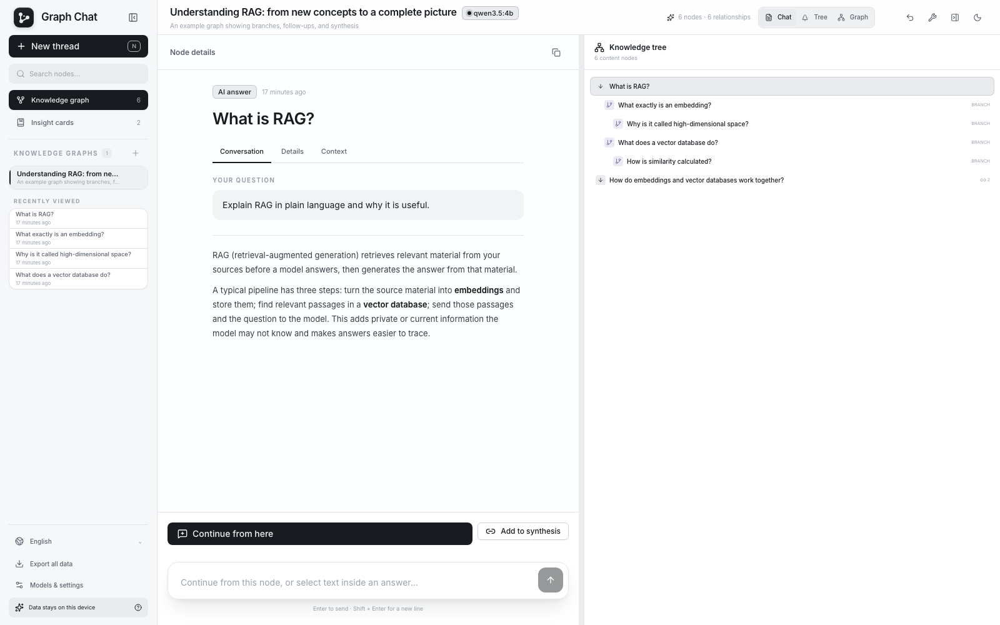
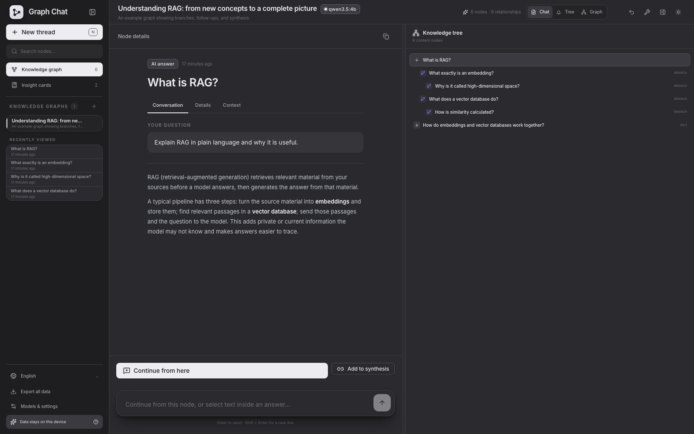
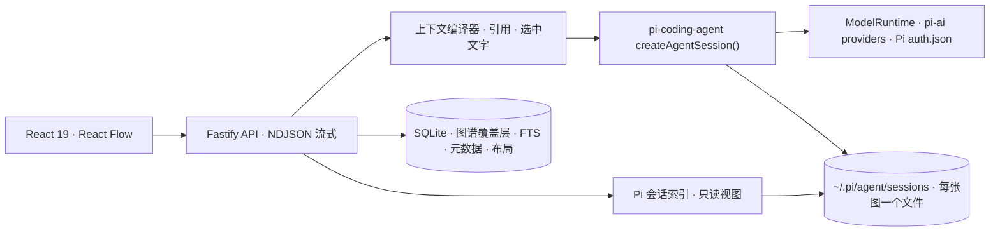

<div align="center">
  

  <h1>Pi Graph Chat</h1>

  <p><strong>在分支中学习，在图谱中记忆，运行在 Pi 之上。</strong></p>
  <p>一个自用的本地优先学习工作区：把 AI 对话变成知识图，并把 Pi coding agent 的会话显示成树。</p>

  <p><a href="./README.md">English</a> · <strong>简体中文</strong></p>

  <p>
    
    
    
    
    
  </p>
</div>

<br />

Pi Graph Chat 是我给自己做的学习工具，不是产品，也不打算做成产品。它建立在两个想法上：

1. **对话应该是图，而不是列表。** 从任意节点分支，在分支里深入一个概念，再引用多个分支提出新问题。每次回答都保留它实际使用的上下文。
2. **Pi 就是运行时。** [Pi agent 生态](https://github.com/earendil-works/pi) 已经有树状会话格式、三十多个 provider、扩展、skills 和 coding agent。Pi Graph Chat 直接依赖它们，而不是重新实现。

<div align="center">
  
  
</div>

## 现在能做什么

| 方向 | 当前实现 |
| --- | --- |
| 知识图 | React Flow 无限画布、分支边与续接边、跨分支引用、综合节点、搜索 |
| Pi 承载的图 | 每张图就是一个 Pi 会话文件；图里的分支就是会话树的分支，**在终端打开** 会用 `pi --session` 接着聊 |
| 精确追问 | 从任意节点继续，或选中回答里的一段文字从那句话分支 |
| 上下文 | 父路径就是会话的当前分支；引用和选中文字以 Pi 的 `custom_message` 条目注入 |
| Pi 会话 | 只读显示本机所有 Pi coding agent 会话的树，Pi 运行时自动刷新 |
| 通过 Pi 使用模型 | ChatGPT 订阅（Codex OAuth）、OpenAI、Anthropic、Google Gemini、OpenRouter、Ollama、任意 OpenAI-compatible endpoint |
| 本地数据 | Bun/Node SQLite + FTS5、版本化 JSON 备份、Obsidian 友好的 Markdown 导出 |
| 导入 | Markdown、纯文本、文本型 PDF |
| 学习 | 知识元数据、学习卡片、本地图谱指标 |
| 界面 | 英文和简体中文，浅色和深色主题 |

### Pi 会话

在任何项目里运行 `pi`，Pi 会把对话以只追加的树保存在 `~/.pi/agent/sessions/`。Pi Graph Chat 读取这些文件，把每个会话显示成回合树：每个提问一张卡片，连同它后面的助手工作，包括被放弃的分支、工具调用、思考过程、标签和当前位置。

- 在侧边栏点击一个会话即可打开。视图每隔几秒刷新，正在运行的 `pi` 会话会随着你的操作在画布上生长。
- **在终端打开** 会复制 `cd <cwd> && pi --session <file>`，你可以带着 Pi 完整的编码工具继续同一个会话。
- 视图是只读的，会话文件由 Pi 负责写入。

如果会话不在默认位置，设置 `PI_CODING_AGENT_SESSION_DIR`（或 `PI_CODING_AGENT_DIR`），优先级与 Pi 本身一致。

## 快速开始

开发需要 Bun 1.3+；Node.js 22.19+ 可以运行构建后的服务。

```bash
git clone https://github.com/everettjf/pi-graph-chat.git
cd pi-graph-chat
bun install
bun run launch
```

`bun run launch` 会构建应用、在 `http://127.0.0.1:4317` 启动本地服务并打开浏览器。需要热更新时运行 `bun run dev`，再打开 [http://localhost:5173](http://localhost:5173)。

首次运行会创建一张关于 RAG 的示例图，不需要任何凭据。数据保存在 `.graphchat/`，可用 `GRAPHCHAT_DATA_DIR` 更改位置。

## 模型

打开侧边栏的「模型与设置」。所有 provider 都由 Pi 的 `pi-ai` 层提供。

| Provider | 认证方式 |
| --- | --- |
| ChatGPT | 通过 Pi 的 `openai-codex` provider 走设备码 OAuth；已有 Codex CLI 登录时会复用 |
| OpenAI | `OPENAI_API_KEY` 或进程内输入 |
| Anthropic | `ANTHROPIC_API_KEY` 或进程内输入 |
| Google Gemini | `GEMINI_API_KEY` 或进程内输入 |
| OpenRouter | `OPENROUTER_API_KEY` 或进程内输入 |
| Ollama | 无需密钥；`http://127.0.0.1:11434/v1` |
| 自定义 | 任意 OpenAI-compatible endpoint，可选进程内密钥 |

凭据就是 Pi 的凭据。在设置里登录 ChatGPT 会写入 Pi 自己的 `~/.pi/agent/auth.json`，所以这里登录一次终端也能用，终端里 `pi /login` 过这里也能用。设置里输入的 API Key 只留在服务进程，不会写入 SQLite、导出文件、日志或 `auth.json`。设置 `PI_CODING_AGENT_DIR` 可以让 Pi 和 Pi Graph Chat 一起使用另一个 agent 目录。

## 架构



Pi 会话文件是对话的正本。SQLite 只保存 Pi 不知道的东西：节点位置、摘要、标签、掌握度、引用关系和全文索引。一张图第一次运行回答时，已有节点会被回放进新建的会话，让树结构一致；之后每次回答都从父节点对应的条目分支。

核心代码：

- [`server/agent-runtime.ts`](./server/agent-runtime.ts) — `createAgentSession()` 运行、通过 `ModelRuntime` 路由 provider、图谱工具、流式事件
- [`server/graph-session.ts`](./server/graph-session.ts) — 打开或创建图对应的 Pi 会话，并把节点回放进去
- [`server/context-compiler.ts`](./server/context-compiler.ts) — 引用与选中文字的上下文
- [`server/pi-sessions.ts`](./server/pi-sessions.ts) — Pi 会话索引与回合折叠
- [`server/openai-codex-auth.ts`](./server/openai-codex-auth.ts) — ChatGPT 设备码 OAuth 生命周期
- [`src/components/graph-canvas.tsx`](./src/components/graph-canvas.tsx) — 知识图交互
- [`src/components/pi-session-view.tsx`](./src/components/pi-session-view.tsx) — Pi 会话树视图

## 开发

```bash
bun run typecheck  # TypeScript 客户端与服务端
bun run test       # Vitest：数据库、Pi runtime、Pi 登录、Pi 会话、UI
bun run build      # 生产构建
bun run test:e2e   # Playwright
bun run test:all   # 以上全部
```

请通过 package 脚本运行 Vitest。脚本强制使用 Bun 运行时，因为数据库依赖 SQLite FTS5；没有 FTS5 的 Node SQLite 会产生误导性的失败。

## 路线图

目标是让 Pi 的会话文件成为唯一真相源，Pi Graph Chat 只在上面加图谱层。顺序如下：

1. 只读的 Pi 会话桥 —— 已完成。
2. 回答通过 `createAgentSession()` 运行，图谱分支就是 Pi 会话分支，同一个会话可以在终端打开 —— 已完成。
3. 把图谱工具、`/graph` 命令和学习 skills 打包成 Pi package，并在图谱运行中加载用户自己的 Pi 扩展和 skills。
4. 让学习会话根植于代码库，使用 Pi 的只读编码工具，并支持跨会话引用节点。

手动验收见 [`docs/CORE_TESTING.md`](./docs/CORE_TESTING.md)，备份格式见 [`docs/GRAPHCHAT_FORMAT.md`](./docs/GRAPHCHAT_FORMAT.md)。

## License

[MIT](./LICENSE) © Everett
